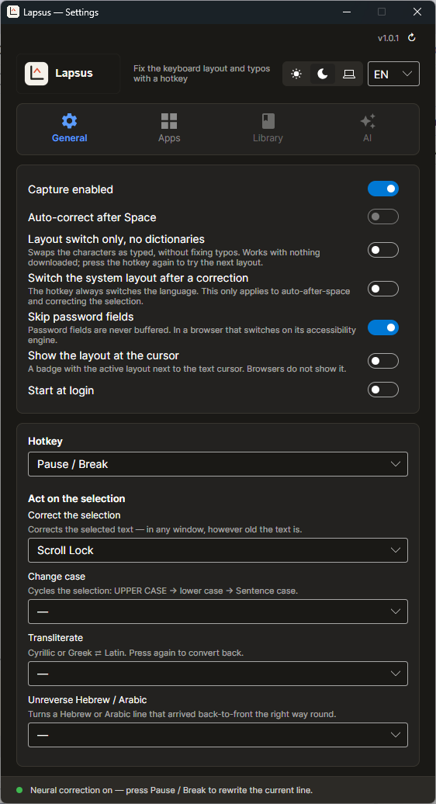
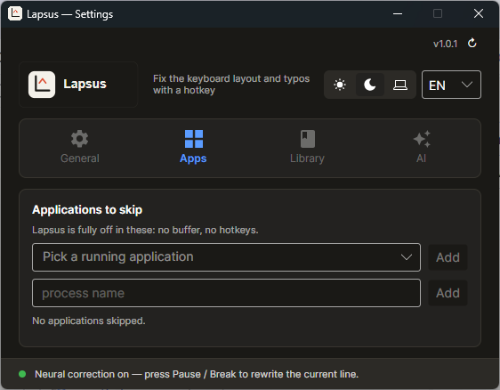
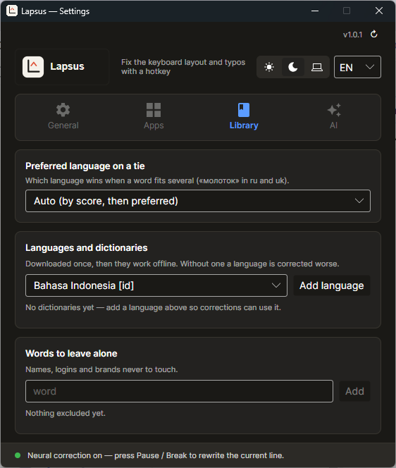
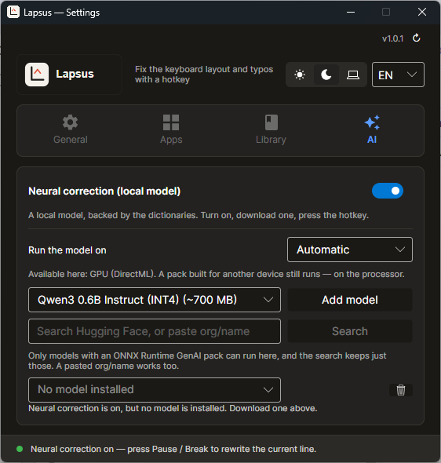

<div align="center">

<picture>
  <source media="(prefers-color-scheme: dark)" srcset="Lapsus/Assets/theme-dark.svg">
  
</picture>

### Types the word you meant, not the keys you hit.

Wrong-layout and typo corrector for Windows and macOS. Lives in the tray, works over any app,
runs entirely on your machine.

[](https://getlapsus.com/)
[](https://github.com/AleksandrPidlozhevich/Lapsus/releases)


</div>

---

The keys were right and the layout was wrong. Press one key and the line is
repaired in place — no retyping, and no waiting on the OS to switch layout.

| You typed | You get | What that takes |
|-----------|---------|-----------------|
| `ghbdsn` | `привіт` | positional remap between installed layouts |
| `сфе` | `cat` | remap **plus** a typo fix (SymSpell, edit distance ≤ 2) |
| `gamarjoba` | `გამარჯობა` | a phonetic layout, letters reached through Shift |
| `sch;n` | `schön` | one mistyped key between two Latin layouts |
| `ntrcn` in `привіт світ ntrcn` | `текст` | only the tail is wrong; the rest is left alone |
| `hello,` | `hello,` | a real word stays a real word |

Six writing systems: **Latin, Cyrillic, Greek, Hebrew, Arabic, Georgian**.

## Screenshots

<table>
  <tr>
    <td width="50%"></td>
    <td width="50%"></td>
  </tr>
  <tr>
    <td align="center"><b>General</b> — capture, hotkeys, what a key does to a selection</td>
    <td align="center"><b>Apps</b> — programs Lapsus stays out of entirely</td>
  </tr>
  <tr>
    <td></td>
    <td></td>
  </tr>
  <tr>
    <td align="center"><b>Library</b> — 33 downloadable word lists, tie-break language</td>
    <td align="center"><b>AI</b> — optional local model, CPU or GPU, your choice</td>
  </tr>
</table>

## What it can do

- **Fix the current line** on a hotkey. Press again to cycle the other readings, and again to get
  back exactly what you typed.
- **Fix a word automatically** after Space (opt-in), behind a filter that leaves `myVar`, URLs,
  ALL-CAPS and very short words alone — unless the line has already switched, in which case `d`
  follows it as `в`. Out of the box it only switches layouts; fixing typos on the fly is a second
  switch, because a name one letter from a dictionary word is not a typo.
- **Fix a selection** — any text, any age, even after a mouse click, through a borrowed clipboard
  that is handed back exactly as it was.
- **Three more things a key can do to a selection**, each with its own hotkey and none of them
  needing a dictionary: cycle **case** (UPPER → lower → Sentence, Greek final sigma included),
  **transliterate** Cyrillic or Greek ⇄ Latin in each language's own romanisation — Ukrainian's 2010
  rules (Київ → Kyiv), Bulgaria's 2009 Streamlined System (Търново → Tarnovo), Belarusian, Macedonian,
  Russian, and ELOT 743 for Greek, the one on Greek passports — and turn a **visually reversed**
  Hebrew or Arabic line back the right way round.
- **Show which layout is active** right next to the text cursor (opt-in), so the mistake
  does not happen in the first place. Apps that draw their own cursor (browsers, Electron)
  do not report a caret, on either OS.
- **Stay out of the way**: named applications are skipped entirely, password fields never reach the
  buffer, and IME input (Chinese / Japanese / Korean) is left to the IME.
- **Speak your language**: the interface ships in 26 languages, right-to-left ones included.

### Three brains, one hotkey

| Brain | Needs | What it does |
|-------|-------|--------------|
| **Dictionary** (default) | a word list | Ranks every reading — as typed, remapped through each installed layout, each also typo-fixed — and switches only past a confidence threshold. |
| **Layout switch only** | nothing at all | One character for another. No word list, no threshold: you pressed the key, and that is the whole decision. |
| **Neural** (opt-in) | a local model | A small instruct LLM rewrites the whole fragment, with the dictionary brain riding along as its adviser when a word list is installed — and standing in for it while the model is not loaded. |

## Install

From [getlapsus.com](https://getlapsus.com/) or the [latest GitHub release](https://github.com/AleksandrPidlozhevich/Lapsus/releases):

- **Windows** — `Lapsus-win-Setup.exe`. Per-user install into `%LocalAppData%\Lapsus`: no admin, no
  UAC prompt. It is unsigned, so SmartScreen says *"Windows protected your PC"* until the installer
  earns reputation — *More info* → *Run anyway*. `Lapsus-win-Portable.zip` is published too.
- **Windows, managed deployment** — `Lapsus-win.msi`, for Group Policy / Intune / SCCM.
  [See below.](#deploying-the-msi)
- **macOS** — the installer from the same release. Grant **Accessibility** and **Input Monitoring**
  on first run (System Settings → Privacy & Security); both are required for capture.

Nothing else to install: the builds are self-contained. Updates are checked in the background and
applied from the tray menu when you ask for them — the app never restarts itself mid-sentence.

### Deploying the MSI

Double-clicked, the MSI asks whether to install for this user or for the machine. Silently, it
installs **per-user** and — ordinary Windows Installer behaviour, not a Lapsus quirk — picks the
fixed drive with the most free space, so `/qn` alone can land the app in `D:\Lapsus`. Always name
the location:

```cmd
:: per-machine, into Program Files (requires elevation)
msiexec /i Lapsus-win.msi /qn ALLUSERS=1 VELOPACK_INSTALLDIR="C:\Program Files\Lapsus"

:: per-user, no elevation
msiexec /i Lapsus-win.msi /qn VELOPACK_INSTALLDIR="%LocalAppData%\Lapsus"
```

The MSI hides its own Add/Remove Programs entry so the app's is the only one visible, and
uninstalling runs the same cleanup hook `Setup.exe` does — the autostart entry goes with it, while
`%APPDATA%\Lapsus` (settings, dictionaries, models) is deliberately kept for a reinstall.

Individuals should take `Setup.exe`: a per-machine install lives somewhere the app cannot write to,
so in-app updates would need elevation. Under a deployment tool updates are the tool's job anyway —
push the next MSI.

## How it works

1. **Capture** — the platform backend tracks the current line in its own buffer
   (`WH_KEYBOARD_LL` on Windows, `CGEventTap` on macOS).
2. **Hypotheses** — the text as typed; remapped through every installed layout; each of those also
   typo-fixed.
3. **Score** — a dictionary hit wins outright; otherwise an interim naturalness score (vowel ratio,
   consonant runs) times an edit penalty, and a switch happens only past a threshold. Scripts that
   cannot be scored honestly — Hebrew, Arabic, Georgian — are dictionary-only by design.
4. **Inject** — the backspaces and the replacement go out as **one** `SendInput` call, as Unicode.
   Nothing waits on an OS layout switch, which is the lag every switcher of this kind is known for.
5. **Optionally** — ask the OS once, afterwards, to switch to the target layout so that continued
   typing matches.

## Dictionaries

Not bundled, and no network traffic until you click Download. In **Settings → Library**, pick from
**33** languages across the six scripts:

- a frequency list — [hermitdave/FrequencyWords](https://github.com/hermitdave/FrequencyWords)
  (OpenSubtitles; MIT code, CC BY-SA 4.0 lists) for most languages, Unicode Unilex for Belarusian and Georgian;
- and for 25 of them a Hunspell spelling dictionary — every form of every word, so a rare case ending no word
  list reaches is still a word — from [LibreOffice](https://github.com/LibreOffice/dictionaries) or
  [wooorm/dictionaries](https://github.com/wooorm/dictionaries). Only dictionaries under licences that leave
  Lapsus free to be sold (MIT, BSD, MPL, LGPL, Apache, CC BY, CC BY-SA, the EKI licence) are used — every one,
  with its authors, is listed in [THIRD-PARTY-NOTICES.md](THIRD-PARTY-NOTICES.md);
- Hebrew, whose Hunspell dictionary (hspell) is AGPL, gets its word forms from Wiktionary and
  [UniMorph](https://github.com/unimorph/heb) instead (CC BY-SA), built into the same kind of dictionary on your
  machine; Bulgarian, Macedonian, German, Italian, Czech and Vietnamese (GPL only) and Finnish (none exists) get
  the list alone.

Every source is fetched from GitHub as published and pinned to a commit — except Hebrew's Wiktionary forms, which
come from [kaikki.org](https://kaikki.org/dictionary/Hebrew/)'s weekly extract (8.6 MB compressed); if it cannot be
reached, Hebrew installs without those forms. Hover over an installed language for its sources and licences. A dictionary installed by an older version shows an update button. Word lists are
pooled by script, so a word counts as real if any loaded dictionary of its script knows it. Files live in `%APPDATA%\Lapsus\dictionaries` (platform-equivalent on macOS) — outside the
install folder, so an update never wipes them.

## Local models (optional)

**Settings → AI** turns the neural brain on and manages models. Four curated ONNX Runtime GenAI
packs — Qwen3 0.6B (the default), Qwen2.5 0.5B, Qwen3 1.7B, Phi-3.5 mini — plus a search box that
takes either words or a pasted `org/name` from Hugging Face and keeps only the repos that really
hold a runnable pack.

The **device is your choice** (Auto / CPU / GPU), and the picker offers only what the machine can
really drive: DirectML on Windows, WebGPU on Apple Silicon, CUDA where a pack ships it, always with
a fall back to CPU. A short correction costs roughly a third of a second on a small pack, because
the prompt is built to stay identical from press to press and is rewound instead of re-fed.

Files land in `%APPDATA%\Lapsus\models\{id}`, beside the dictionaries and equally safe from an
update.

## Build & run

```bash
dotnet restore Lapsus.slnx
dotnet build   Lapsus.slnx
dotnet run --project Lapsus/Lapsus.csproj
dotnet test    Lapsus.slnx
```

Requires the [.NET 10 SDK](https://dotnet.microsoft.com/download). Keyboard capture needs Windows or
macOS; on Linux the app runs with a no-op backend, so the UI and the core work but nothing is
captured yet.

### Packaging

Both installers come from [Velopack](https://velopack.io), one script per platform, and both take
their version from the repo-root `VERSION` file that `Directory.Build.props` also reads — so the
assembly version and the installer version cannot drift apart.

```powershell
dotnet tool install -g vpk        # once

.\scripts\package-windows.ps1     # -> build/windows/Releases/   (PowerShell 5.1 or 7)
./scripts/package-macos.sh        # -> build/macos/Releases/
```

Upload **every** file from the output folder to one GitHub Release tagged `v<version>`; that release
*is* the update feed the app reads, and there is nothing else to host. Set `LAPSUS_SIGN_PARAMS` to
signtool arguments before the Windows script to get a signed installer.

Step-by-step walkthrough, prerequisites and troubleshooting included:
**[scripts/BUILDING.md](scripts/BUILDING.md)**.

## Privacy

Correction runs locally, the neural model included. There is no telemetry, no analytics and no
account, and what you type never leaves your computer. Password fields are skipped wherever the OS
lets us see them, the typing buffer is overwritten when it is dropped, and it is thrown away after
one minute of silence.

The app goes online for exactly these, and nothing else:

| When | Where | What it sends |
|------|-------|---------------|
| You install or update a dictionary | `raw.githubusercontent.com`, `kaikki.org` | an ordinary download request |
| You search for or download a neural model | `huggingface.co` | the search text you typed; an ordinary download request |
| At launch (not in the Microsoft Store version, which the Store updates) | GitHub Releases | an update check |
| You enter a licence key, and about once a month after that | the licence server (Supabase) | the key, and a salted SHA-256 hash of the machine's ID — the raw ID never leaves the computer |

Every one of those servers sees your IP address, as any download does. Settings, the leave-alone word
list, excluded apps, the licence key, dictionaries, models and the crash log stay on your computer in
the app-data folder (`%APPDATA%\Lapsus` on Windows); the Microsoft Store version keeps
them in its own package folder and deletes them when it is uninstalled. Full policy:
[getlapsus.com/en/privacy/app](https://getlapsus.com/en/privacy/app/).

## Status

| Piece | State |
|-------|-------|
| Core "brain" — positional remapping, SymSpell, naturalness scoring, orthography rules | Done |
| Windows backend (`WH_KEYBOARD_LL` + `SendInput`) | Done |
| macOS backend (`CGEventTap` + Accessibility) | Done |
| Optional local neural rewrite (ONNX Runtime GenAI, CPU / GPU) | Done |
| Linux backend (evdev / uinput) | Not yet — the UI and settings still run |
| Character trigrams for words no list knows | Done |
| Word-bigram context ranking | Next |
| Greek accents typed through the dead key on the wrong layout (`kal;ow` → καλός) | Done on Windows; macOS does not read the dead key yet |
| macOS notarization | Outstanding |

## Project layout

- `Lapsus.Core` — the OS-independent brain: layouts, spelling, correction, typing buffer, text transforms
- `Lapsus.Core.Tests` — xUnit coverage of the core
- `Lapsus` — the Avalonia tray UI, the Windows / macOS input backends, the ONNX GenAI host
- `Lapsus.Tests` — the app-layer decisions that need no OS

Contributor notes: [CLAUDE.md](CLAUDE.md).

## Free for private people, paid for companies

**Private people use Lapsus for free — freelancers included.** Companies pay, per seat. The line is
who uses it, not what for: no feature is locked behind a key, nothing expires, and there is no copy
protection.

At every launch Lapsus checks whether this computer is administered by an organisation — an Active
Directory domain, Entra ID, or a real MDM server. If it is and no key is installed, a small window
says a license is needed, with thirty days to try it first. It is a reminder, not a gate: nothing
is disabled and the app keeps working whatever it finds.

The Windows *edition* is deliberately not part of that check: Enterprise LTSC and Education run on
plenty of home machines, and nagging those people forever would be wrong.

A license is tied to one computer, so a key cannot be shared around an office. Entering a key does
two things: the signature is checked on your machine, and the key is exchanged with the license
server for an **activation token** good for that one computer and 35 days. The token is then checked
offline at every launch and renewed silently about a week before it lapses.

See [COMMERCIAL-USE.md](COMMERCIAL-USE.md) for exactly where the line falls, and
[LICENSE](LICENSE) for the same line in legal words. Seats are bought on the
[pricing page](https://getlapsus.com/en/pricing/); for terms the grant in `LICENSE` does not cover — a
site licence, a written agreement for your legal department — write to <info@getlapsus.com>.

### Pro

See [pricing](https://getlapsus.com/en/pricing/). One-time, one seat. For a private person who wants
to pay anyway, or a one-person company. A 30-day trial key is on the same page.

### Business

See [pricing](https://getlapsus.com/en/pricing/). Per seat, per year. Signed installers, an MSI for
Intune / Group Policy, priority support, and a written licence for your legal department. A 30-day
trial key is on the same page.

### Seats

A Business key carries a seat count, and a seat is claimed by the computer that activates it: one
person, one machine. Re-activating the same key on the same computer costs nothing — activation is
idempotent by (key, machine) — so a reinstall or an update never spends a second seat. Moving a seat
to a different computer, or raising the count, goes through <info@getlapsus.com>.

### What leaves your computer, and when

Exactly one request, and only on a machine that has a paid key:

| | |
|---|---|
| **Sent** | the license key, and a machine fingerprint — `SHA-256(salt + platform id)`, truncated to 22 characters |
| **When** | when you enter a key, and roughly monthly to renew the token |
| **Never sent** | the raw hardware id, anything you type, which apps you use, your files, any telemetry |

The fingerprint cannot be reversed into a serial number and is salted per product, so it correlates
with nothing outside Lapsus. On a free install the license feature sends nothing at all — the
organisation check, the reminder and every correction happen entirely on your machine; the only other
traffic is the update check against the GitHub release feed at launch, described above. If the license server is unreachable,
nothing breaks: the installed token keeps working until it actually expires, and after that the app
still corrects text, it just shows the reminder again.

For an app that reads every keystroke, this list is the whole basis on which you would install it.
It is enforced by the code in `Lapsus/Licensing` — there is no other network path.

### Issuing keys (for the maintainer)

Keys and activation tokens are ECDSA P-256 signatures, verified offline against the public key
compiled into the app. **Signing happens only on the server** — three Supabase Edge Functions, whose
source lives in the Supabase dashboard and not in this repository:

| Function | Called by | Guard | Issues |
|---|---|---|---|
| `lapsus-issue` | the [trial form](https://getlapsus.com/en/trial/) | none, by design | pro, 1 seat, 30 days — hard-coded, request fields ignored |
| `lapsus-admin-issue` | you, from a terminal | `x-lapsus-admin` header | any edition, seat count and expiry, taken from the request |
| `lapsus-activate` | the app | none needed | a 35-day activation token, after checking the key's signature and claiming a seat |

`lapsus-activate` needs no guard because the request proves itself: it carries a key that only the
private half could have signed. `lapsus-admin-issue` can prove nothing of the sort — "issue a licence
for Acme" says nothing about who is asking — so it needs a shared secret, `LAPSUS_ADMIN_SECRET`, held
in Supabase secrets and nowhere else. Without it that endpoint is an open Business-key generator, and
the trial limits become pointless: why take thirty days when the next URL along grants forever?

Issuing a paid key, in Git Bash:

```bash
curl -X POST "https://<project>.supabase.co/functions/v1/lapsus-admin-issue" -H "content-type: application/json" -H "x-lapsus-admin: $LAPSUS_ADMIN_SECRET" -d '{"email":"buyer@example.com","name":"Acme","edition":"business","seats":25}'
```

`edition` is `pro` or `business`; `seats` defaults to 1. Business defaults to one year and Pro to no
expiry at all, and either is overridden by `"years": 3` or `"expires": "2030-01-01"`.

#### Creating or rotating the signing pair

In **Git Bash** (it ships with OpenSSL; PowerShell does not), somewhere outside the repository:

```bash
openssl genpkey -algorithm EC -pkeyopt ec_paramgen_curve:P-256 | openssl pkcs8 -topk8 -nocrypt -outform DER -out priv.der && openssl pkey -in priv.der -inform DER -pubout -outform DER -out pub.der && echo "PUBLIC : $(base64 -w0 pub.der)" && echo "PRIVATE: $(base64 -w0 priv.der)"
```

`-topk8` is not optional. Without it OpenSSL writes a SEC1 key, which starts `MHcCAQEE`, and the app
rejects it. A correct private key starts `MIGH`; the public one starts
`MFkwEwYHKoZIzj0CAQYIKoZIzj0DAQcDQgAE`.

A rotation touches **three** places, and missing the third is the failure that looks like a bug:

1. `LAPSUS_PRIVATE_KEY` in Supabase secrets — signs keys and tokens.
2. `LAPSUS_PUBLIC_KEY` in Supabase secrets — `lapsus-activate` checks pasted keys with it.
3. `LicenseVerifier.EmbeddedPublicKey` in this repository — the app checks everything with it.

Change the first two and not the third, and the app rejects keys the server has just minted. Change
the pair at all after the first sale, and every key already issued stops verifying.

Verify a new public key took:

```bash
dotnet test Lapsus.Core.Tests --filter TheShippedVerifierNeverThrows
```

## License

[Business Source License 1.1](LICENSE) — the same text MariaDB, HashiCorp and Sentry ship,
unmodified; only the Parameters block at the top is ours. Its **Additional Use Grant** puts the line
exactly where the terms above put it:

- **A natural person may use Lapsus in production for free**, on as many computers as they like D
  freelancers and sole traders included, paid work included.
- **Private use of a work computer stays free**, where the organisation allows the machine to be
  used privately.
- **An organisation needs a paid, per-seat licence**, after thirty days to evaluate — the same
  thirty days `LicenseStatus.EvaluationDays` counts down, and the same length as the trial key on the
  pricing page.

Reading, building, modifying and redistributing the source is granted to everyone by the license
body; what the Additional Use Grant governs is *production use*. Four years after any given version
is published that version converts to the **Mozilla Public License 2.0** — per version, so the code
becomes open source on a delay without the current release ever being free for companies.

[COMMERCIAL-USE.md](COMMERCIAL-USE.md) explains the same line in plain language; `LICENSE` is the
operative text, and where the two differ `LICENSE` governs.

The components Lapsus ships inside it keep their own licences, reproduced with their copyright
notices in [THIRD-PARTY-NOTICES.md](THIRD-PARTY-NOTICES.md) — all MIT, plus the SIL OFL for the IBM Plex
and Noto Sans Georgian typefaces. Dictionary and model packs are not bundled at all and keep their upstream licenses — see
`DictionaryCatalog` / `ModelCatalog`, or the Settings window.
